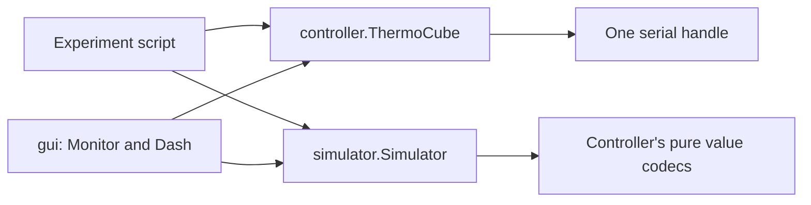

# Architecture

Three implementation modules and the package export file live under `src/thermocube/`:

| Module | Responsibility |
| --- | --- |
| `controller.py` | Synchronous device API, serial I/O, R2 encoding/decoding, `Status`, `Faults`, `SafetyError` |
| `simulator.py` | Hardware-free device API with a first-order thermal model and fault/link injection |
| `gui.py` | Optional `Monitor`, CSV/history, Dash UI and simulation launcher |
| `__init__.py` | Public device/result exports; version from installed package metadata |

The controller imports neither simulator nor GUI. Importing any module opens no
port and starts no thread. Dash is imported only by `create_app()`; core devices,
monitoring, CSV and headless simulation need only pyserial.

## Device path and ownership

`read_temperature()` takes the controller's RLock, checks query arming, builds its
REMOTE command in `_exchange()`, waits for the monotonic 350 ms interval, writes
once, accumulates the expected reply, validates it and returns a number.
There is no public raw-command API or separate protocol/transport object.

The lock covers each complete operation: status is fault → temperature → setpoint;
setpoint changes are fault preflight → write → readback; start is preflight → start.
STOP uses the same pacing and waits for in-flight operations. The application
sequences conflicting intents and explicit STOP/disconnect calls.

Own one controller per physical port and share it between callers. Windows serial
handles are exclusive; POSIX opening requests pyserial's advisory exclusivity.
There is no global registry. Every new owner must verify the stream and physical
state; replacing an object cannot prove recovery. OS/USB timing is not a hard
emergency-stop guarantee.

The controller keeps a handle, lock, next-write time, query/control flags, requested
run state and uncertainty latch. Opening clears permissions and sends no bytes.
Uncertain I/O closes/disarms, never retries, and requires acknowledged physical
recovery before rearming. Faults inhibit queries/start/setpoint while existing
write permission still allows an explicit STOP.

Cancellation during serial opening, reading, writing, closing or recovery checks requires
recovery. The driver attempts to close the handle and propagates KeyboardInterrupt
or SystemExit; it sends no cleanup commands. A failed open still releases any
acquired handle, and cancellation during that cleanup is not swallowed.

`Status` and `Faults` are immutable observations. Status timestamps precede the
first query and never make old temperatures appear fresh. M5 reports standby;
legacy run intent remains unverified. Raw and unknown fault bits stay visible.
The simulator also leaves reported run state absent for the legacy profile.

`Faults(raw, profile)` derives `active`, `unknown_mask` and `standby` from the raw
byte. `Status(timestamp, temperature_c, setpoint_c, faults, requested_run)` derives
`reported_run` from its faults. Read these attributes as before; computed values
are no longer constructor arguments or `dataclasses.asdict()` fields. Code that
creates observations must use these constructors; the separate fault-decoder
helper is removed. CSV still writes all of these values explicitly.

## Optional consumers and shutdown

`Monitor` is an explicitly started, single-use worker. It samples an already
connected/armed device, stores bounded history and optionally flushes CSV rows.
The worker receives its CSV handle directly and closes it when polling ends.
Errors create gaps. CSV failure ends polling. The application owns connection,
recovery and its audit/abort requirements. A stop timeout leaves I/O ownership
with the caller until the worker has joined.
If worker construction or startup fails, its CSV is closed and the monitor stays
stopped; calling stop() remains safe. Create a new monitor for another attempt.

Dash refreshes only cached observations. Confirmed actions call the public device
API. Missing, future or older-than-3.5-second observations cannot enable START or
setpoint changes; existing control permission permits STOP. Browser reload does
not recreate the device or worker. Stop the monitor before releasing the device.

Simulation retains thermal/run state over link loss. It models the software API,
not serial firmware, pump flow or calibrated thermal performance. The launcher
(`thermocube` or `python -m thermocube.gui`) always uses simulation.

## Packaging and environments

`pyproject.toml` defines the package version and dependencies, the `gui` extra,
the `dev` dependency group and the `uv_build` backend. The backend includes the
package's CSS and typing marker automatically. Its source distribution also
contains the tests, examples, lockfile, documentation and review evidence.

`uv sync --locked` installs the package from `src/` into `.venv`. Tests import
that installation; they do not add the source directory to `sys.path`.
`uv build` creates a source archive and wheel. Artifact checks create independent
uv environments for the wheel and the extracted source, so child processes cannot
fall back to the development checkout.
