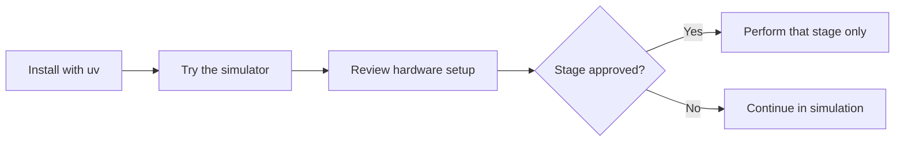
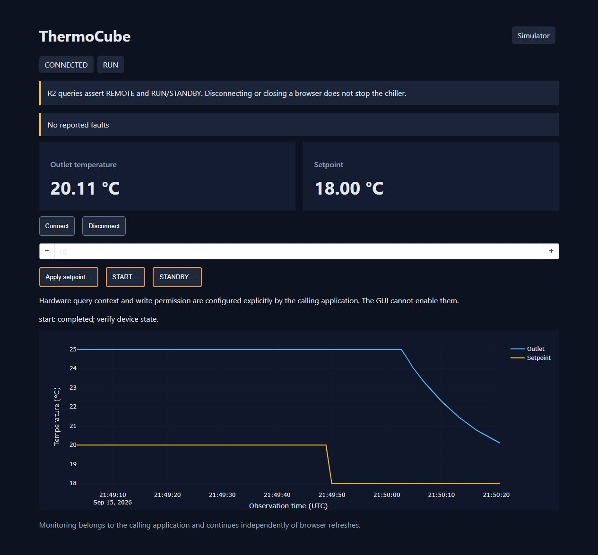

# thermocube-control

Read a ThermoCube chiller's temperature and faults, set a target temperature, and
request RUN or STANDBY from Python. Try the same operations without a chiller using
the built-in simulator, live chart and CSV logging.

## Current status

| Area | Status |
| --- | --- |
| Python API, simulator, local GUI and CSV | Implemented in version **0.2.0**. |
| Software checks | **65 tests pass; 94.98% statement coverage**, plus lint, types and installed-package checks on Windows / Python 3.12.14. [Evidence](docs/REVIEW.md). |
| Real hardware | Targets R2 RS-232 unit **10-400-1D-1-CP-R2-LT-AR-267**. Compatibility is **unconfirmed**; no physical validation stage is approved or completed. |



## 1. Quick Start — no hardware needed

Install **Git** and [uv](https://docs.astral.sh/uv/getting-started/installation/),
then paste these commands into PowerShell or a terminal:

```sh
git clone https://github.com/cct1123/thermocube-control.git
cd thermocube-control
uv run --locked --extra gui thermocube
```

Already have the repository? Run just the last command from its folder.
uv sets up the Python environment and dependencies; no manual activation is needed.
The project selects Python 3.12 locally and requires Python 3.11 or newer.

Open **[http://127.0.0.1:8050](http://127.0.0.1:8050)** in your browser.
Keep the terminal running. The `thermocube` command **always uses the simulator**;
it never opens a serial port.

## 2. Try a cooling run

The demo starts **CONNECTED / STANDBY**, with an outlet at **25 °C** and a
**20 °C** setpoint (target). To see it cool:

1. Enter **18** in the setpoint box. Click **Apply setpoint…** and confirm.
2. Click **START…** and confirm. Watch the blue outlet trace approach the target.
3. Click **STANDBY…** and confirm to end simulated temperature control.
4. Press **Ctrl+C** in the terminal to exit the demo.



*Actual simulator screenshot. The thermal model illustrates the workflow; it
does not predict the real chiller's cooling rate or performance.*

### Without a browser

```sh
uv run --locked thermocube --headless --duration 10 --csv simulation.csv
```

This records about 10 seconds of **standby** observations, prints the final
`Status(...)`, and exits. `simulation.csv` is created in the current folder;
choose a new filename for each run because existing files are never overwritten.

## 3. Use it from Python

Run the [included example](examples/experiment.py):

```sh
uv run --locked python examples/experiment.py
```

Its device workflow is:

```python
import time
from thermocube import Simulator

with Simulator() as device:
    device.set_setpoint(18)  # Celsius
    device.start()
    try:
        for _ in range(3):
            time.sleep(1.05)
            print(device.status())
    finally:
        device.stop()
```

Each status contains the outlet temperature, setpoint, faults and run state.
`with` connects on entry and disconnects on exit; **stopping is a separate action**.
The hardware class, `ThermoCube`, has the same device operations plus explicit
query/control safety gates. Follow the hardware procedure before using it.

## 4. Prepare real hardware

**Hold: no physical stage is currently approved.** Follow the
[staged hardware procedure](docs/HARDWARE_VALIDATION.md) with the responsible lab
operator before discovering ports, opening a connection or sending commands.
Even temperature queries can change the chiller's control state.

| Check before connection | Required setup or unresolved item |
| --- | --- |
| Unit and manual | Confirm the actual controller/firmware and applicable manual. The supplied ThermoCube II M5 manual may not match this unit. |
| Adapter and cable | Verify genuine **RS-232** voltage levels, pinout and cable continuity. Do not assume TTL compatibility or infer wiring from connector gender. |
| Serial settings | Implemented: **9600 baud, 8 data bits, no parity, 1 stop bit, no flow control**. Default timeout: 0.5 s; minimum command spacing: 350 ms. |
| Protocol | Resolve the fault-profile conflict (`legacy-r2` / `thermocube-ii-m5`) and framing ambiguity. The driver sends **raw binary with no CR/LF**; it does not auto-detect either. |
| Thermal setup | Check coolant, priming, leaks, ventilation and the attached load. Establish actual safe temperature bounds and an independent physical abort method. |

Proceed only through individually approved stages:

| Stages | What they establish |
| --- | --- |
| **0–1** | Inspection, then approved isolated-adapter and separately approved attached open/close checks with zero transmitted bytes. Opening can still affect RTS/DTR lines. |
| **2–4** | After profile/framing confirmation: one approved standby fault query, then separate temperature and setpoint comparisons with the panel. |
| **5–7** | Separate write approval and safe bounds, then a small approved setpoint change and a bounded start/stop test. **Never advance automatically.** |

Use direct Python calls for these stages; keep the GUI and background monitoring
off. The procedure includes the exact one-query example and evidence to record.
`ThermoCube` requires an explicitly selected port; queries and control start locked.
Before enabling writes, supply operator-approved `limits_c=(minimum, maximum)`.
There are **no default hardware operating limits**.

## 5. Use safely

- **Queries are active commands.** They assert REMOTE and RUN/STANDBY. A stale RUN
  query can request RUN again after a stop; there is no established neutral read.
- **Disconnect is not STOP.** Closing the browser or Python process does not
  guarantee standby, pump shutdown or return to LOCAL. Keep an independent abort method.
- **Use one controller per physical port.** Share it between callers and sequence
  experiment actions explicitly. The controller serializes and paces commands.
- **Do not retry uncertain commands.** Communication uncertainty closes and
  disarms the connection. Verify the stream and physical state before the
  [explicit recovery procedure](docs/HARDWARE_VALIDATION.md#abort-and-later-recovery).
- **Simulation bounds are not hardware limits.** The simulator defaults to
  −5…50 °C; real limits must come from the actual device, coolant and load.
  The supplied GUI is for one local operator, without network authentication.

## Troubleshooting

| Symptom | What to do |
| --- | --- |
| `uv` is not recognized | Install uv using the link above, then reopen the terminal. |
| Browser cannot connect | Keep the launch command running and open the printed URL. If port 8050 is busy, run `uv run --locked --extra gui thermocube --port 8051` and open `http://127.0.0.1:8051`. `--port` selects the **HTTP** port. |
| `FileExistsError` when saving CSV | Choose a new `--csv` filename. Existing data is preserved. |
| Simulator Apply/START is disabled | Click **Connect** if disconnected and wait for a fresh, fault-free observation. Check the displayed error. |
| Hardware `SafetyError` | Check the approved stage, confirmed profile/framing, query context and write limits. The GUI cannot arm hardware or enable writes. |
| Hardware timeout, connection error or unknown fault | Stop traffic and follow the hardware hold/recovery procedure. Do not loop retries, try alternate profiles/framing, or replace the controller to bypass a lock. |

## For developers

The package uses `src/thermocube/` with three implementation modules:
`controller`, `simulator` and `gui`. The core needs only pyserial; optional
monitoring/CSV and the Dash UI live in `thermocube.gui`. Importing the package
starts no worker and opens no device.

```sh
uv sync --locked --extra gui
uv run --locked --extra gui pytest
uv run --locked ruff check src tests tools examples
uv run --locked mypy
uv build
```

Dependencies and build settings live in `pyproject.toml`; commit `uv.lock` with
dependency changes. Use `uv add --dev PACKAGE` for development tools.

- [Full validation commands](docs/TESTING.md) — format, coverage and isolated package checks.
- [Architecture and integration](ARCHITECTURE.md) — API, optional monitoring and ownership.
- [Protocol and open questions](docs/PROTOCOL.md) · [manual provenance](inputs/README.md).
- [Review and evidence](docs/REVIEW.md) · [contributor instructions](AGENTS.md) · [prompt history](prompt%20log.md).
