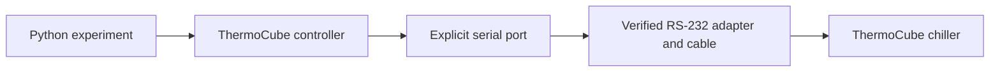

# thermocube-control

Control a ThermoCube chiller from a Python experiment: read outlet temperature
and faults, set a target temperature, and request RUN or STANDBY over RS-232.
The target unit is **10-400-1D-1-CP-R2-LT-AR-267**.

## Current status

| Area | Status |
| --- | --- |
| Driver | Version **0.2.0** implements serial connection, temperature/fault queries, setpoints and start/stop controls. |
| Software validation | **65 tests pass; 94.98% coverage** on Windows / Python 3.12.14. Lint, types and package checks pass. [Evidence](docs/REVIEW.md). |
| Physical validation | **Compatibility is unconfirmed. No hardware stage is approved or completed.** The fault profile, framing, wiring and operating limits still need confirmation for the actual unit. |

The workflow below prepares an approved hardware session. Follow the
[staged hardware procedure](docs/HARDWARE_VALIDATION.md) before discovering ports,
opening a connection or sending commands; **even queries can change device state**.



## 1. Install and check the software

Install **Git** and [uv](https://docs.astral.sh/uv/getting-started/installation/),
then run in PowerShell or a terminal:

```sh
git clone https://github.com/cct1123/thermocube-control.git
cd thermocube-control
uv sync --locked
```

Already have the repository? Run `uv sync --locked` from its folder.
uv manages the environment and selects Python 3.12; Python 3.11+ is required.
Hardware scripts need no GUI.

Check the complete software suite **without accessing hardware**:

```sh
uv run --locked --extra gui pytest -q
```

The extra enables GUI tests. All tests block physical serial access.

## 2. Prepare the chiller and serial connection

| You need | What to establish |
| --- | --- |
| Unit identification | Confirm the model, controller/firmware and applicable manual. The supplied M5 manual may not describe this unit. |
| RS-232 adapter and cable | Verify voltage levels, pinout and cable continuity. Do not use TTL levels or infer wiring from connector gender. |
| One explicit port | Record the approved port, e.g. `COM5` or `/dev/ttyUSB0` (**examples only**). Close other serial applications; share one controller per port. No auto-discovery. |
| Chiller and load | Check coolant suitability, fill/priming, leaks and ventilation. Establish a physically safe starting state and an independent abort method. |
| Protocol confirmation | Determine whether `legacy-r2` or `thermocube-ii-m5` applies. Confirm **raw binary with no CR/LF** before queries. Do not trial profiles or terminators against the unit. |

The driver configures **9600 baud, 8 data bits, no parity, 1 stop bit, no flow
control**. Defaults are a **0.5 s** timeout and **350 ms** minimum command spacing.
It opens once without sending commands; opening can still affect RTS/DTR lines.

Complete inspection and the approved zero-transmit adapter/connection checks
(**Stages 0–1**) before any query. Then establish physical STANDBY and obtain
approval for **Stage 2**. Use direct calls during initial validation; keep
background monitoring and the GUI off.

## 3. First hardware use: one fault query

**Run only after Stage 2 approval and profile/framing confirmation.** Replace the
port and profile placeholders with the values in the approved lab record.
`run=False` acknowledges an already established STANDBY state; the query itself
selects REMOTE and reasserts STANDBY.

Save as `hardware_check.py`:

```python
from thermocube import ThermoCube
from thermocube.controller import QUERY_ACK

PORT = "REPLACE_WITH_APPROVED_PORT"
PROFILE = "REPLACE_WITH_CONFIRMED_PROFILE"

with ThermoCube(
    PORT,
    profile=PROFILE,
    binary_framing_confirmed=True,
) as device:
    device.arm_queries(run=False, acknowledgement=QUERY_ACK)
    print(device.read_faults())
```

```sh
uv run --locked python hardware_check.py
```

This sends **one fault query (`88`)**, prints `Faults(...)`, then disconnects.
Setpoint/start/stop stay locked. **Disconnect sends no STOP or LOCAL command.**

Record the raw fault byte and panel observations. Healthy standby is hexadecimal
`40` for M5 or `00` for legacy; legacy does not report run state. An unknown bit,
fault, unexpected transition or uncertain response means **stop and review**.

After each stage passes, the next separately approved check replaces the one
`print(...)` line above:

| Approved check | Use one call | Compare with |
| --- | --- | --- |
| Stage 3: outlet temperature | `print(device.read_temperature())` | Front-panel temperature, using the predeclared tolerance. |
| Stage 4: setpoint | `print(device.read_setpoint())` | Front-panel target; record the initial setpoint. |

Values default to **Celsius**; temperature methods also accept `unit="F"`.
Do not add a polling loop or `status()` to these checks: `status()` makes up to
three queries. Keep the procedure's hold points and command/time budgets.

## 4. Set a target and control a run

Write-enabled use needs **separate Stage 5+ approval**. Record the permitted target,
run duration, command budget, restoration and shutdown plan. There are **no default
hardware limits**: use the intersection of the actual chiller, coolant and load limits.

For the **Stage 6 setpoint check**, start a separate script/session. Define `PORT`,
`PROFILE`, `MIN_C`, `MAX_C` and `TARGET_C` from that session's approved record;
then use this workflow in physically confirmed STANDBY:

```python
from thermocube import ThermoCube
from thermocube.controller import CONTROL_ACK, QUERY_ACK

with ThermoCube(
    PORT,
    profile=PROFILE,
    binary_framing_confirmed=True,
    limits_c=(MIN_C, MAX_C),
) as device:
    device.arm_queries(run=False, acknowledgement=QUERY_ACK)
    device.enable_control(CONTROL_ACK)
    print(device.set_setpoint(TARGET_C))
```

This performs fault preflight → setpoint write → readback. Compare the returned
value and panel with the approved target; wire resolution is 0.1 °F. There is no
automatic start or restoration. API acknowledgements do not grant stage approval
or verify physical conditions.

Use these methods on the **same connected, explicitly armed controller** within
an approved experiment:

| Task | Method | Behavior to account for |
| --- | --- | --- |
| Read outlet / target | `read_temperature()` / `read_setpoint()` | Each is an active query asserting the selected run state. |
| Inspect faults | `read_faults()` | Keeps raw and unknown bits visible; faults/state mismatch inhibit further queries. |
| Read a combined observation | `status()` | Up to three paced queries, faults first. Temperatures may be absent on faults. Requires approval for that acquisition scope. |
| Set a target | `set_setpoint(target_c)` | Needs approved bounds and enabled control; fault preflight, write, readback. |
| Request RUN | `start()` | Needs enabled control; fault preflight then RUN. Verify the physical transition. |
| Request STANDBY | `stop()` | Needs enabled control. Does not guarantee pump shutdown or an emergency stop. |
| Release the port | `disconnect()` | Sends no STOP or LOCAL command. |

For initial start/stop validation, follow the exact
[Stage 7 sequence](docs/HARDWARE_VALIDATION.md#stage-7--bounded-remote-startstop-validation)
and observe the panel at its hold points. Ongoing monitoring, CSV and GUI use
need separately approved acquisition scope after initial validation. The
[optional integration details](ARCHITECTURE.md#optional-consumers-and-shutdown)
explain how to share the controller with a monitor.

## 5. Finish the session or handle a failure

- Follow the approved standby/restoration sequence and verify the physical state
  before releasing the port. **Disconnecting or closing Python is not an abort.**
- Stop background monitoring before disconnecting. A stale RUN query can request
  RUN again after a stop or manual intervention; there is no established neutral read.
- On uncertain communication, stop traffic and use the independent physical abort
  method if needed. The driver closes/disarms and never replays the command.
- Follow the [recovery procedure](docs/HARDWARE_VALIDATION.md#abort-and-later-recovery)
  before reopening/rearming. Replacing the controller or restarting Python does
  not establish recovery.

## Troubleshooting

| Symptom | What to check |
| --- | --- |
| Cannot open the approved port | Check the recorded port, adapter driver and OS access permissions; close other serial applications. An open port does not prove device identity. |
| `Unknown fault profile` | Replace the example placeholder with the profile confirmed for this controller. Do not guess from a response. |
| Queries or controls are locked (`SafetyError`) | Check connection, approved physical query state, profile/framing confirmation and explicit arming. Writes also need `limits_c` and `enable_control(CONTROL_ACK)`. |
| Setpoint rejected (`ValueError`) | Check Celsius bounds and both requested and rounded values. Do not widen bounds to bypass the rejection. |
| Timeout, unexpected bytes, unknown fault or state mismatch | Hold the procedure; verify wiring, protocol evidence and physical state. Do not loop retries, append CR/LF or change profiles as a probe. |
| `uv` is not recognized | Install uv using the link above and reopen the terminal. |

## Optional: rehearse without hardware

Rehearse with the [Python experiment](examples/experiment.py) or demo GUI:

```sh
uv run --locked python examples/experiment.py
uv run --locked --extra gui thermocube
```

Open **[http://127.0.0.1:8050](http://127.0.0.1:8050)**. Enter **18**, confirm
**Apply setpoint…**, then **START…**. Finish with **STANDBY…** and **Ctrl+C**.

<details>
<summary>Simulator preview</summary>


*Simulation does not establish real cooling performance or safe hardware bounds.*

</details>

The `thermocube` launcher always uses simulation. `--port` selects the HTTP port,
not a chiller's serial port.

For a browser-free standby CSV demo:

```sh
uv run --locked thermocube --headless --duration 10 --csv simulation.csv
```

CSV never overwrites existing files. For a hardware GUI, lab software passes its monitor to
`thermocube.gui.create_app()`; the GUI cannot arm queries or enable hardware writes.
The supplied server is for one local operator, without network authentication.

## For developers

`src/thermocube/` contains three implementation modules: `controller`, `simulator`
and `gui`. The core needs only pyserial; monitoring/CSV and the optional Dash UI
live in `thermocube.gui`. Imports start no worker and open no device.

```sh
uv run --locked ruff check src tests tools examples
uv run --locked mypy
uv build
```

Keep dependencies in `pyproject.toml` and commit changes with `uv.lock`.
Use `uv add --dev PACKAGE` for development tools.

- [Full validation commands](docs/TESTING.md) · [architecture and integration](ARCHITECTURE.md).
- [Protocol and open questions](docs/PROTOCOL.md) · [manual provenance](inputs/README.md).
- [Review and evidence](docs/REVIEW.md) · [contributor instructions](AGENTS.md) · [prompt history](prompt%20log.md).
